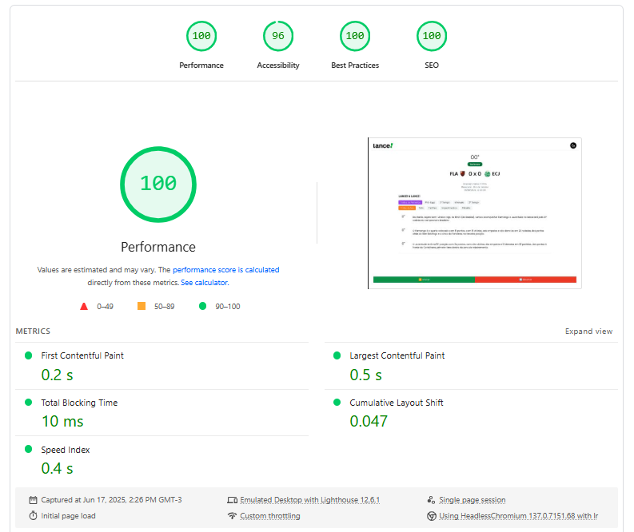
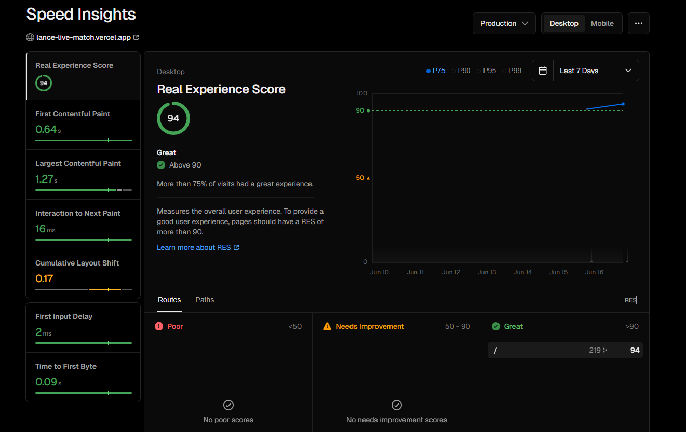

# ⚽ Lance! a Lance! 

Ferramenta web de cobertura ao vivo de uma partida de futebol, no estilo "lance a lance", desenvolvida como desafio técnico para simular a experiência de um portal esportivo.

---

## 🎯 Objetivo

Entregar um MVP funcional de uma página de cobertura ao vivo, com foco em:
- Performance
- Organização de código
- Experiência do usuário (UX)
- Uso inteligente de Next.js + TypeScript

---
## 🛠️ Tecnologias Utilizadas

- **Framework:** [Next.js](https://nextjs.org/) (App Router)
- **Linguagem:** TypeScript
- **Estilo:** TailwindCSS
- **Gerenciamento de estado:** Zustand (justificativa: leve, simples e ideal para apps com múltiplos estados reativos)
- **Persistência local:** localStorage via middleware do Zustand (para manter placar e progresso do usuário)
- **API simulada:** JSON estático ([match.json](public/match.json)), seguindo o formato do desafio ([arquivo base](https://drive.google.com/file/d/1-H3zGxtHU6eyfasjAXnKx1JwhS_nEejg/view?usp=sharing))

---

## 💡 Contexto

O projeto simula a cobertura de um jogo de futebol, permitindo ao torcedor acompanhar em tempo real os eventos do jogo, com interface clara, cronômetro, lista de eventos e filtros.

---


## 📋 Funcionalidades

- **Relógio do jogo:** Cronômetro entre 0 e 90 minutos, com controle manual (iniciar, pausar, resetar)
- **Lista de eventos:** Exibe todos os lances importantes (gol, cartão, substituição, etc.)
- **Comentário do narrador:** Texto livre com timestamp
- **Filtros de eventos:** Permite filtrar por tipo (gols, cartões, impedimentos, etc.)
- **Tema escuro/claro:** Alternância automática ou manual
- **Mobile-first:** Layout responsivo para dispositivos móveis
- **Persistência:** Placar e progresso mantidos após refresh
- **SEO básico:** Metadados otimizados para compartilhamento social (Open Graph/Twitter)
---


## 🚀 Como rodar o projeto

### 1. Instale o Yarn (caso ainda não tenha)

O Yarn é um gerenciador de pacotes alternativo ao npm, muito usado em projetos modernos Node.js.

```bash
npm install -g yarn
```
> Isso instala o Yarn globalmente na sua máquina.

---

### 2. Clone o repositório

```bash
git clone https://github.com/BerhartDev/lance-live-match.git
cd lance-live-match
```

---

### 3. Instale as dependências

```bash
yarn install
```

---

### 4. Rode o projeto em modo desenvolvimento

```bash
yarn dev
```

---

### 5. Acesse no navegador

Abra [http://localhost:3000] para ver o projeto rodando.

---

### 6. Rodando com Docker

Você pode rodar o projeto em ambiente de produção usando Docker:

```bash
docker build -t lance-live-match .
docker run -p 3000:3000 lance-live-match
```

Acesse [http://localhost:3000](http://localhost:3000) no navegador.

---

## 📦 Estrutura do Projeto

```
src/
  app/
    components/      # Componentes de UI (Scoreboard, EventList, etc.)
    hooks/           # Hooks customizados (useFetchMatch, useMatchClock, etc.)
    store/           # Zustand stores (placar, eventos, etc.)
    types/           # Tipos TypeScript
  public/
    match.json       # Dados simulados do jogo
    icons/           # Ícones SVG para eventos
```

---

## 📝 O que foi feito

- [x] Cobertura lance a lance com cronômetro e eventos
- [x] Filtros de eventos
- [x] Persistência local do placar
- [x] Tema escuro/claro
- [x] SEO básico e preview social
- [x] Mobile-first

## ❌ O que faltou 

- [ ] Transformar filtros em dropdown buttons
- [ ] ReplayControls com controle de velocidade da simulação
- [ ] Possibilidade de selecionar mais de 1 filtro por vez   
- [ ] Análise de eventos mais robusta
- [ ] Logo dos times sendo exibida junto com o evento
- [ ] Melhor estilização para telas maiores
- [ ] Integração com WebSocket para eventos em tempo real
- [ ] Suporte a múltiplas partidas
- [ ] Animações e transições mais sofisticadas
- [ ] Pagina de dados e estatísticas do jogo 
- [ ] Painel administrativo para inserir eventos ao vivo
- [ ] Testes automatizados (Jest/Cypress)

## 🚀 Melhorias de Performance

- [ ] **React.memo** para componentes que não mudam frequentemente (MatchInfo, Scoreboard)
- [ ] **useMemo** para cálculos pesados como `groupEventsByPeriod` e `getActionLabel`
- [ ] **useCallback** para funções passadas como props
- [ ] Implementar **react-window** ou **react-virtualized** para a EventList
- [ ] Renderizar apenas eventos visíveis na viewport
- [ ] Melhorar performance com muitas narrações
- [ ] Lazy load de componentes pesados
- [ ] Code splitting por rotas (quando implementar múltiplas partidas)
- [ ] Otimização de imports
- [ ] Muitas outras
---

##  💻 Sobre o desenvolvimento.

Este projeto em particular foi desenvolvido totalmente fora da zona de conforto, na casa da sogra, sem monitor e sem um espaço dedicado para trabalhar. Fiz o que eu pude com o que eu tinha. Espero que você goste! :)

#### 1 - Análise do problema
* Analisei cuidadosamente o desafio técnico, os requisitos funcionais e técnicos, e o contexto de uso (portal esportivo, experiência do usuário, performance).
* Estudei o arquivo de dados fornecido e as regras de negócio para cobertura lance a lance.
#### 2 - Planejamento da lógica
* Identifiquei as principais funcionalidades: cronômetro, lista de eventos, filtros, placar, persistência local e SEO.
* Pensei na melhor forma de estruturar o fluxo de dados e a interação entre os componentes.
#### 3 - Divisão em pequenas tarefas
* Quebrei o projeto em etapas menores, como:
* Montar a estrutura do projeto Next.js
* Criar componentes principais (Scoreboard, EventList, Clock, etc.)
* Implementar hooks customizados para lógica de negócio
* Integrar o Zustand para gerenciamento de estado
* Adicionar persistência local e tema escuro/claro
* Otimizar SEO e responsividade
#### 4 - Pra finalizar
Testei cada parte individualmente, ajustando a UX e a performance.
Refatorei componentes para melhor legibilidade e reuso.






---

## 🚨 Documentação no Notion em breve!

A documentação detalhada deste projeto será publicada em breve.

---
